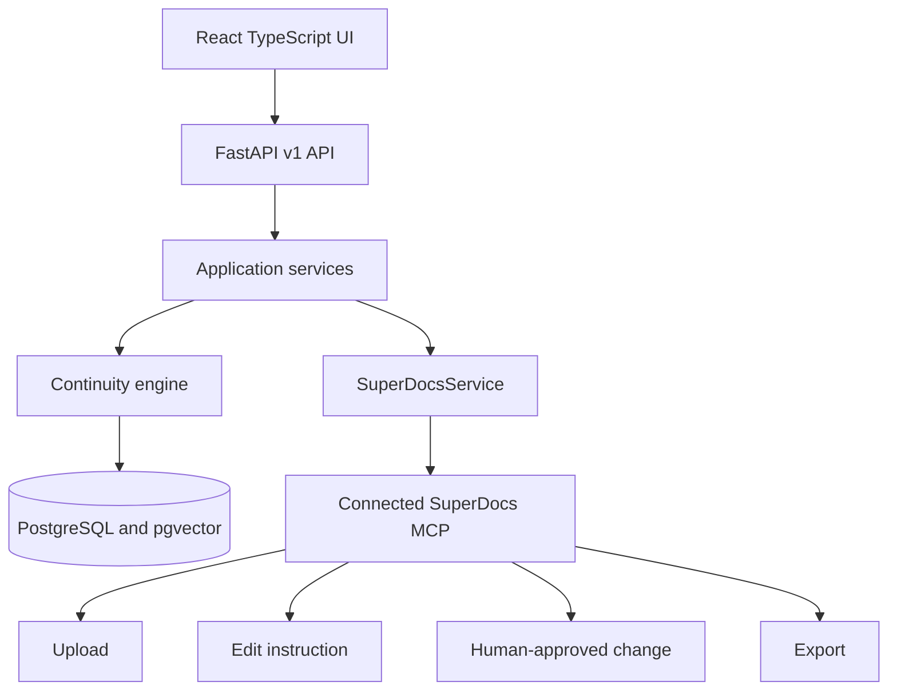

# Continuum — Series Bible & Continuity Checker

Built by Maharavan.

A production-oriented reference application for maintaining grounded, versioned story canon and reviewing contradictions before either a manuscript or the Series Bible changes.

## Problem and use case

Long-running fiction accumulates character details, relationships, locations, chronology, and world rules across many documents. Continuum imports chapters through SuperDocs, extracts evidence-backed claims, retrieves relevant established facts, and creates a review queue instead of silently rewriting canon.

## Architecture

The application owns facts, provenance, findings, decisions, workflow state, and audit history. SuperDocs remains the source of truth for document upload, editing, approval, and export.

## Series Bible model

`bible_facts` stores immutable versions. A new accepted value supersedes rather than deletes the previous version. `evidence` records document, chapter, section/page when available, source chunk, and exact passage. Specialized character, place, timeline, and world-rule catalogs support navigation while facts remain canonical.

## Continuity engine and retrieval

`FactRetriever` first narrows candidates by series, normalized entity, attribute, and current status. `ContinuityService` distinguishes new information, compatible updates, possible contradictions, and grounded contradictions. This avoids an all-to-all comparison. The retrieval seam permits pgvector reranking without coupling domain rules to an embedding provider.

## Agent workflow and crash recovery

The LangGraph graph makes ingest, extraction, validation, retrieval, classification, human review, editing, approval, Bible update, and export decisions visible. `workflow_runs` stores current stage, completed stages, input state, errors, and optimistic version. A unique run/stage workflow event prevents duplicate checkpoint effects after restart.

## Real SuperDocs MCP integration

The backend uses the official MCP SDK over Streamable HTTP and the exact live-server tool names discovered from `tools/list`:

- `upload_document_base64`
- `chat_async` with `approval_mode=ask_every_time`
- `approve_change`
- `export_document`

There is no fake SuperDocs endpoint and no browser API key. The adapter is isolated in `backend/src/series_bible/infrastructure/superdocs_service.py`.

## Human approval

A finding supports Keep Existing, Accept New, Intentional Change, or Reject. Keeping the existing fact does not alter a manuscript. A correction is a separate proposed-change operation. SuperDocs receives the edit in ask-every-time mode, and the approval tool is called only after the user decides.

## Source grounding and prompt-injection protection

Supported facts require non-empty exact evidence and a source reference. Manuscript content is delimited as untrusted data and never placed in privileged instructions. Structured Pydantic validation occurs before domain or database operations; an LLM never mutates storage directly.

## Security

- Configuration and secrets come from environment variables.
- The MCP key is backend-only and excluded from logs.
- Upload names are reduced to safe basenames, restricted by format, and size limited.
- SQLAlchemy emits parameterized queries.
- CORS is explicit and errors hide stack traces.
- Concurrent finding/change decisions lock rows and reject repeated decisions.

## API

OpenAPI is available at `/api/docs`. Main endpoints:

- `POST/GET /api/v1/series`
- `POST /api/v1/series/{id}/documents`
- `POST /api/v1/series/{id}/runs`, `GET /api/v1/runs/{id}`
- `GET /api/v1/series/{id}/bible` and `/findings`
- finding approve/reject/intentional-change and propose-edit routes
- `POST /api/v1/proposed-changes/{id}/approve`
- `POST /api/v1/export`
- `/health/live` and `/health/ready`

## Local setup

1. Put the real server-side SuperDocs key in `SUPERDOCS_MCP_API_KEY` in either the project `.env` or `backend/.env`.
2. Configure Google sign-in with `GOOGLE_CLIENT_ID` (the OAuth web-client ID) and a long random `JWT_SECRET`. The client ID is intentionally passed to the frontend build; the JWT secret and SuperDocs key remain server-side.
3. In Google Cloud, add `http://localhost:5173` as an authorized JavaScript origin for the OAuth client.
4. Run `docker compose up --build`.
5. Open <http://localhost:5173>; API docs are at <http://localhost:8000/api/docs>.

The database image includes pgvector. Migrations run before the API starts.

PDF, DOCX, RTF, Markdown, HTML, TeX, and TXT are parsed by SuperDocs with
`return_html=true`; the returned semantic blocks are normalized into grounded
chunks. Set `EXTRACTION_PROVIDER=openai_compatible` plus the `LLM_*` settings
for production structured extraction. The default grounded rules provide a
local, deterministic baseline. Bible facts receive local 384-dimensional
feature-hash embeddings and pgvector performs semantic fallback retrieval.

Set `API_AUTH_TOKEN` in deployed environments. API clients then send it as a
Bearer token; the web client reads it from the `continuum_api_token` local
storage key. `API_AUTH_TOKEN` must contain only the token value, without the
`Bearer ` prefix; the backend adds that scheme when validating requests.
SuperDocs edits are polled with the real `get_job` MCP tool until
the proposal is ready, and approval remains a separate human action.

The frontend Dockerfile builds the production bundle in a Linux Node stage and
serves it from Nginx. After changing frontend source, rebuild the frontend image
with `docker compose build frontend`.

## User-owned document chat

The unified series workspace displays the overview, current Series Bible, and
continuity review queue beside a document chat. Google ID tokens are verified
by the backend, which issues a short-lived signed application session. Each
chat session is linked to the authenticated user and series, so a user's
grounded chat history is restored after they sign in again. Chat answers remain
read-only: they retrieve Bible facts, story events, and manuscript chunks and
include source citations rather than changing canon or documents.

In environments where outbound HTTPS is available only through a host-local
proxy, the Compose backend uses host networking and PostgreSQL is published on
host port `5433` to preserve access to the MCP endpoint.

PDF and DOCX imports can take several minutes while SuperDocs parses a large
manuscript. The backend and frontend proxy allow up to five minutes for an
import; do not retry the same upload while the first request is still running.

## Testing

Run `make install`, then `make test` and `make lint`. Unit tests cover grounded extraction validation, continuity classification, prompt-injection boundaries, and the exact MCP service boundary. The deterministic LLM provider is for automated domain tests only; it does not replace SuperDocs.

## Demo flow

The six files in `demo/chapters` establish Elena's blue eyes, her relationship to Mark, Castle Raven's location, one magic rule, and chronology. Chapter 6 states that Elena has green eyes. Import Chapters 1–5, run extraction, import Chapter 6, review both exact passages, choose Keep Existing, optionally request a correction, inspect the proposed change, approve it explicitly, then export.

## Operational notes

- The initial Alembic migration is explicit and reviewable, including the
    pgvector extension, constraints, and indexes.
- Job polling is bounded by configurable interval and timeout values; timed-out
    requests fail safely without approving or applying a document change.
- Bearer authentication is optional for local demos and should be enabled in
    every shared deployment.
