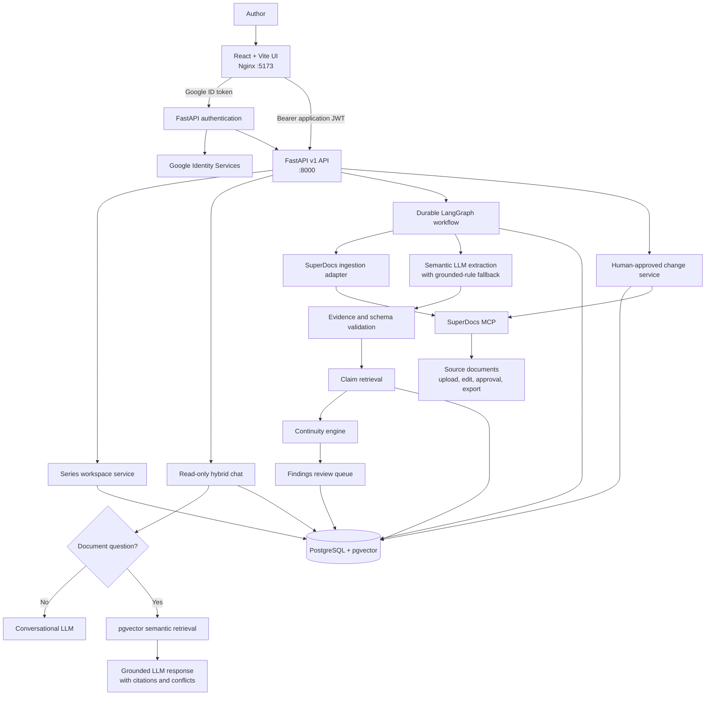

# Continuum — Series Bible & Continuity Checker

Built by Maharavan.

A production-oriented reference application for maintaining grounded, versioned story canon and reviewing contradictions before either a manuscript or the Series Bible changes.

## Problem and use case

Long-running fiction accumulates character details, relationships, locations, chronology, and world rules across many documents. Continuum imports chapters through SuperDocs, extracts evidence-backed claims, retrieves relevant established facts, and creates a review queue instead of silently rewriting canon.

## Architecture

### Deployment and ownership

The `frontend` container serves the React application through Nginx on port
`5173`. The `backend` container runs FastAPI and Alembic migrations on port
`8000`; it uses host networking in this development Compose configuration so it
can reach a host-local outbound proxy. PostgreSQL with pgvector is the durable
store and is published on port `5433`.

The backend owns series metadata, document chunks, extracted facts, immutable
Bible fact versions, evidence, workflow checkpoints, findings, review decisions,
audit history, users, and user-owned chat sessions. SuperDocs remains the source
of truth for the original document and its approved edits/exports; its API key
is never sent to the browser.

### Ingestion and continuity workflow

1. The author uploads a supported manuscript format through the API.
2. The SuperDocs adapter parses it into semantic HTML/blocks, which the backend
    stores as grounded document chunks with document, chapter, section, and page
    provenance where available.
3. A durable LangGraph run extracts explicit claims. The configured
    OpenAI-compatible semantic extractor recognises equivalent wording; local
    grounded rules run alongside it and provide a safe fallback if the provider
    fails or omits an explicit pattern.
4. Every extracted fact must pass Pydantic validation and retain exact supporting
    evidence before it can enter comparison.
5. `FactRetriever` finds relevant current Bible facts using normalized claims and
    pgvector semantic fallback retrieval. The continuity engine compares values.
6. The workflow also compares every pair of facts sharing the same document,
    chapter, entity, and attribute. This detects contradictions inside one newly
    uploaded chapter, even before a fact is accepted into the Bible.
7. New facts become versioned Bible facts. Contradictions create a review finding
    with `OLD` and `NEW` evidence records; they never overwrite canon automatically.

For example, semantic extraction normalizes both “Marcus was Elena's cousin” and
“Elena's younger brother Marcus” to Elena's `relationship_marcus` claim. Their
different values produce an intra-chapter contradiction with both passages shown
in Findings.

### Authentication and chat retrieval

Google Identity Services issues an ID token to the browser. The backend verifies
that token, creates or updates the local user record, and returns a signed
application JWT. The JWT scopes persisted chat history to that user and series.

Chat is read-only. Its router sends greetings and general questions to the
conversational LLM without unnecessary retrieval. Questions about the manuscript,
Bible, characters, places, chronology, or conflicts use hybrid retrieval across
Bible facts, story events, and pgvector-ranked manuscript chunks. The response is
generated only from the retrieved context, returns citations from stored evidence,
and surfaces relevant unresolved findings instead of selecting canon on the
author's behalf.

## Series Bible model

`bible_facts` stores immutable versions. A new accepted value supersedes rather than deletes the previous version. `evidence` records document, chapter, section/page when available, source chunk, and exact passage. Specialized character, place, timeline, and world-rule catalogs support navigation while facts remain canonical.

## Continuity engine and retrieval

`FactRetriever` first narrows candidates by series, normalized entity, attribute, and current status. `ContinuityService` distinguishes new information, compatible updates, possible contradictions, and grounded contradictions. This avoids an all-to-all comparison. The retrieval seam permits pgvector reranking without coupling domain rules to an embedding provider.

Within a single chapter, an additional all-pairs comparison groups facts by
document, chapter, normalized entity, and attribute. This is intentionally
independent of Bible retrieval, so a first upload can still report inconsistent
claims inside itself.

## Agent workflow and crash recovery

The LangGraph graph makes ingest, extraction, validation, retrieval, classification, human review, editing, approval, Bible update, and export decisions visible. `workflow_runs` stores current stage, completed stages, input state, errors, and optimistic version. A unique run/stage workflow event prevents duplicate checkpoint effects after restart.

## Real SuperDocs MCP integration

The backend uses the official MCP SDK over Streamable HTTP and the exact live-server tool names discovered from `tools/list`:

- `upload_document_base64`
- `chat_async` with `approval_mode=ask_every_time`
- `approve_change`
- `export_document`

There is no fake SuperDocs endpoint and no browser API key. The adapter is isolated in `backend/src/series_bible/infrastructure/superdocs_service.py`.

## Human approval

A finding supports Keep Existing, Accept New, Intentional Change, or Reject. Keeping the existing fact does not alter a manuscript. A correction is a separate proposed-change operation. SuperDocs receives the edit in ask-every-time mode, and the approval tool is called only after the user decides.

## Source grounding and prompt-injection protection

Supported facts require non-empty exact evidence and a source reference. Manuscript content is delimited as untrusted data and never placed in privileged instructions. Structured Pydantic validation occurs before domain or database operations; an LLM never mutates storage directly.

## Security

- Configuration and secrets come from environment variables.
- The MCP key is backend-only and excluded from logs.
- Upload names are reduced to safe basenames, restricted by format, and size limited.
- SQLAlchemy emits parameterized queries.
- CORS is explicit and errors hide stack traces.
- Concurrent finding/change decisions lock rows and reject repeated decisions.

## API

OpenAPI is available at `/api/docs`. Main endpoints:

- `POST/GET /api/v1/series`
- `POST /api/v1/series/{id}/documents`
- `POST /api/v1/series/{id}/runs`, `GET /api/v1/runs/{id}`
- `GET /api/v1/series/{id}/bible` and `/findings`
- finding approve/reject/intentional-change and propose-edit routes
- `POST /api/v1/proposed-changes/{id}/approve`
- `POST /api/v1/export`
- `/health/live` and `/health/ready`

## Local setup

1. Put the real server-side SuperDocs key in `SUPERDOCS_MCP_API_KEY` in either the project `.env` or `backend/.env`.
2. Configure Google sign-in with `GOOGLE_CLIENT_ID` (the OAuth web-client ID) and a long random `JWT_SECRET`. The client ID is intentionally passed to the frontend build; the JWT secret and SuperDocs key remain server-side.
3. In Google Cloud, add `http://localhost:5173` as an authorized JavaScript origin for the OAuth client.
4. Run `docker compose up --build`.
5. Open <http://localhost:5173>; API docs are at <http://localhost:8000/api/docs>.

The database image includes pgvector. Migrations run before the API starts.

PDF, DOCX, RTF, Markdown, HTML, TeX, and TXT are parsed by SuperDocs with
`return_html=true`; the returned semantic blocks are normalized into grounded
chunks. `EXTRACTION_PROVIDER=openai_compatible` enables semantic structured
extraction through the configured `LLM_*` settings. Explicit local grounded rules
are merged with semantic results and act as a fallback if semantic extraction is
unavailable. Bible facts receive local 384-dimensional feature-hash embeddings
and pgvector performs semantic fallback retrieval.

Set `API_AUTH_TOKEN` in deployed environments. API clients then send it as a
Bearer token; the web client reads it from the `continuum_api_token` local
storage key. `API_AUTH_TOKEN` must contain only the token value, without the
`Bearer ` prefix; the backend adds that scheme when validating requests.
SuperDocs edits are polled with the real `get_job` MCP tool until
the proposal is ready, and approval remains a separate human action.

The frontend Dockerfile builds the production bundle in a Linux Node stage and
serves it from Nginx. After changing frontend source, rebuild the frontend image
with `docker compose build frontend`.

## User-owned document chat

The unified series workspace displays the overview, current Series Bible, and
continuity review queue beside a document chat. Google ID tokens are verified
by the backend, which issues a short-lived signed application session. Each
chat session is linked to the authenticated user and series, so a user's
grounded chat history is restored after they sign in again. The chat uses a
hybrid RAG route: greetings and other normal conversational messages receive a
natural response without an unnecessary document lookup. Questions about the
manuscript, Series Bible, people, places, chronology, or prior document
discussion retrieve semantically relevant chunks from pgvector alongside Bible
facts and story events, then include source-document citations. Relevant open
contradictions are surfaced for a human decision instead of being chosen
automatically. Chat remains read-only and never changes canon or documents.

In environments where outbound HTTPS is available only through a host-local
proxy, the Compose backend uses host networking and PostgreSQL is published on
host port `5433` to preserve access to the MCP endpoint.

PDF and DOCX imports can take several minutes while SuperDocs parses a large
manuscript. The backend and frontend proxy allow up to five minutes for an
import; do not retry the same upload while the first request is still running.

## Testing

Run `make install`, then `make test` and `make lint`. Unit tests cover grounded extraction validation, continuity classification, prompt-injection boundaries, and the exact MCP service boundary. The deterministic LLM provider is for automated domain tests only; it does not replace SuperDocs.

## Demo flow

The six files in `demo/chapters` establish Elena's blue eyes, her relationship to Mark, Castle Raven's location, one magic rule, and chronology. Chapter 6 states that Elena has green eyes. Import Chapters 1–5, run extraction, import Chapter 6, review both exact passages, choose Keep Existing, optionally request a correction, inspect the proposed change, approve it explicitly, then export.

## Operational notes

- The initial Alembic migration is explicit and reviewable, including the
    pgvector extension, constraints, and indexes.
- Job polling is bounded by configurable interval and timeout values; timed-out
    requests fail safely without approving or applying a document change.
- Bearer authentication is optional for local demos and should be enabled in
    every shared deployment.
