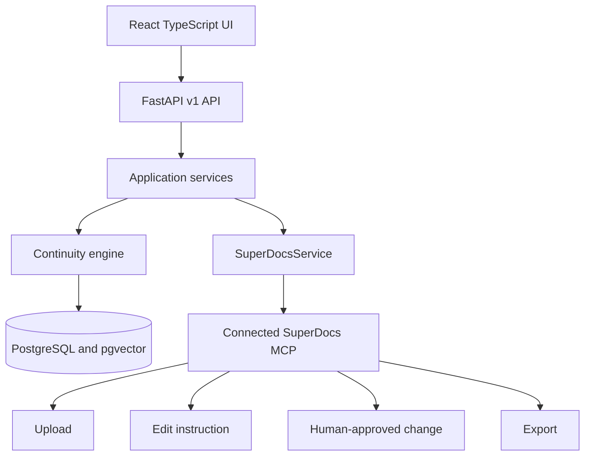

# Continuum — Series Bible & Continuity Checker

A production-oriented reference application for maintaining grounded, versioned story canon and reviewing contradictions before either a manuscript or the Series Bible changes.

## Problem and use case

Long-running fiction accumulates character details, relationships, locations, chronology, and world rules across many documents. Continuum imports chapters through SuperDocs, extracts evidence-backed claims, retrieves relevant established facts, and creates a review queue instead of silently rewriting canon.

## Architecture

The application owns facts, provenance, findings, decisions, workflow state, and audit history. SuperDocs remains the source of truth for document upload, editing, approval, and export.

## Series Bible model

`bible_facts` stores immutable versions. A new accepted value supersedes rather than deletes the previous version. `evidence` records document, chapter, section/page when available, source chunk, and exact passage. Specialized character, place, timeline, and world-rule catalogs support navigation while facts remain canonical.

## Continuity engine and retrieval

`FactRetriever` first narrows candidates by series, normalized entity, attribute, and current status. `ContinuityService` distinguishes new information, compatible updates, possible contradictions, and grounded contradictions. This avoids an all-to-all comparison. The retrieval seam permits pgvector reranking without coupling domain rules to an embedding provider.

## Agent workflow and crash recovery

The LangGraph graph makes ingest, extraction, validation, retrieval, classification, human review, editing, approval, Bible update, and export decisions visible. `workflow_runs` stores current stage, completed stages, input state, errors, and optimistic version. A unique run/stage workflow event prevents duplicate checkpoint effects after restart.

## Real SuperDocs MCP integration

The backend uses the official MCP SDK over Streamable HTTP and the exact live-server tool names discovered from `tools/list`:

- `upload_document_base64`
- `chat_async` with `approval_mode=ask_every_time`
- `approve_change`
- `export_document`

There is no fake SuperDocs endpoint and no browser API key. The adapter is isolated in `backend/src/series_bible/infrastructure/superdocs_service.py`.

## Human approval

A finding supports Keep Existing, Accept New, Intentional Change, or Reject. Keeping the existing fact does not alter a manuscript. A correction is a separate proposed-change operation. SuperDocs receives the edit in ask-every-time mode, and the approval tool is called only after the user decides.

## Source grounding and prompt-injection protection

Supported facts require non-empty exact evidence and a source reference. Manuscript content is delimited as untrusted data and never placed in privileged instructions. Structured Pydantic validation occurs before domain or database operations; an LLM never mutates storage directly.

## Security

- Configuration and secrets come from environment variables.
- The MCP key is backend-only and excluded from logs.
- Upload names are reduced to safe basenames, restricted by format, and size limited.
- SQLAlchemy emits parameterized queries.
- CORS is explicit and errors hide stack traces.
- Concurrent finding/change decisions lock rows and reject repeated decisions.

## API

OpenAPI is available at `/api/docs`. Main endpoints:

- `POST/GET /api/v1/series`
- `POST /api/v1/series/{id}/documents`
- `POST /api/v1/series/{id}/runs`, `GET /api/v1/runs/{id}`
- `GET /api/v1/series/{id}/bible` and `/findings`
- finding approve/reject/intentional-change and propose-edit routes
- `POST /api/v1/proposed-changes/{id}/approve`
- `POST /api/v1/export`
- `/health/live` and `/health/ready`

## Local setup

1. Copy `backend/.env.example` to `backend/.env`.
2. Put the real server-side SuperDocs key in `SUPERDOCS_MCP_API_KEY`.
3. Run `docker compose up --build`.
4. Open <http://localhost:5173>; API docs are at <http://localhost:8000/api/docs>.

The database image includes pgvector. Migrations run before the API starts.

The checked-in `frontend/dist` is the validated production bundle used by the
network-independent Nginx image. After changing frontend source, run
`npm install && npm run build` before rebuilding Docker.

## Testing

Run `make install`, then `make test` and `make lint`. Unit tests cover grounded extraction validation, continuity classification, prompt-injection boundaries, and the exact MCP service boundary. The deterministic LLM provider is for automated domain tests only; it does not replace SuperDocs.

## Demo flow

The six files in `demo/chapters` establish Elena's blue eyes, her relationship to Mark, Castle Raven's location, one magic rule, and chronology. Chapter 6 states that Elena has green eyes. Import Chapters 1–5, run extraction, import Chapter 6, review both exact passages, choose Keep Existing, optionally request a correction, inspect the proposed change, approve it explicitly, then export.

## Known limitations

- A production LLM completion callback and embedding provider must be configured for automated extraction and semantic reranking; deterministic extraction exists only for tests.
- SuperDocs asynchronous job polling should be delegated to a worker for high-volume deployments.
- Authentication/authorization is deployment-specific and should be placed at the gateway or added before multi-tenant use.
- The initial migration intentionally mirrors SQLAlchemy metadata; later schema changes should use explicit Alembic operations.
